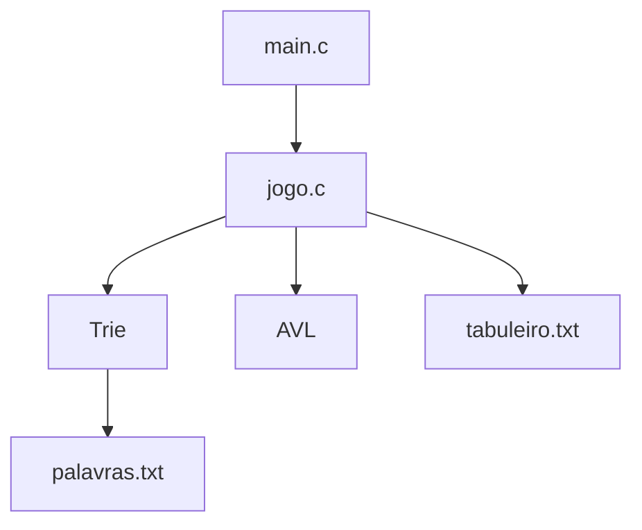

# IMD0039 — Jogo de Caça-Palavras


## Visão Geral
Este projeto implementa um **jogo de caça-palavras automatizado** em linguagem C.  
O programa:

- lê um tabuleiro a partir de um arquivo;
- lê uma lista de palavras válidas;
- utiliza uma **Trie** para validar prefixos e palavras;
- utiliza uma **Árvore AVL** para armazenar as palavras encontradas;
- busca automaticamente palavras em **todas as direções possíveis** do tabuleiro;
- oferece um menu para interação.

---

## Estrutura do Projeto

```
caça-palavras/
│-- avl.c          # Implementação da árvore AVL;
│-- avl.h          # Cabeçalho da AVL;
│-- trie.c         # Implementação da Trie;
│-- trie.h         # Cabeçalho da Trie;
│-- jogo.c         # Lógica central do jogo;
│-- main.c         # Função principal (menu);
│-- palavras.txt   # Conjunto de palavras válidas;
│-- tabuleiro.txt  # Tabuleiro do jogo;
│-- Makefile       # Automação da compilação;
│-- README.md      # Documentação do projeto.
```

---

## Componentes do Projeto

### 1. Trie (trie.c / trie.h)

Estrutura digital utilizada para validar palavras e prefixos.

---

### 2. AVL (avl.c / avl.h)

Árvore usada para armazenar **palavras encontradas** de forma ordenada e balanceada.

---

### 3. Lógica do Jogo (jogo.c)

Responsável por:

- ler o tabuleiro;
- carregar palavras na Trie;
- buscar automaticamente no tabuleiro;
- armazenar resultados na AVL.

Busca realizada em 8 direções:

```
(-1,-1) (-1,0) (-1,+1)
( 0,-1)  P C   ( 0,+1)
(+1,-1) (+1,0) (+1,+1)
```

---

## Formato dos Arquivos de Entrada

### palavras.txt

```
ganimedes
calisto
io
europa
...
```

### tabuleiro.txt

```
10 10
O V W Q O L L A D G
H A E O J K O N A Q
...
```

---

## Como funciona a busca

- horizontal (→ ←);
- vertical (↑ ↓);
- diagonal;
- 8 direções completas.

---

## Módulos do Projeto

| Módulo | Arquivos | Responsabilidade |
|--------|----------|------------------|
| Trie | trie.c / trie.h | Validar palavras/prefixos |
| AVL | avl.c / avl.h | Armazenar palavras válidas |
| Jogo | jogo.c | Lógica da busca |
| Principal | main.c | Menu e fluxo geral |

---

## Fluxo Geral do Programa

1. Carregar palavras → Trie;
2. Carregar tabuleiro;
3. Buscar palavras;
4. Validar sequências;
5. Inserir palavras válidas → AVL;
6. Mostrar resultados.

---

## Diagramas

### Estrutura dos módulos (Mermaid)



---

## Instalação

```
git clone https://github.com/jtfrl/clang_EDB2.git
cd caça-palavras
make
./caça_palavras
```

---

## Requisitos da Disciplina

- Valor: **5,0 pontos**;
- Dupla opcional;
- Entrega via SIGAA;
- Compilar em Windows & Linux.

---

## Autores

- Ian Daniel Varela Marques;
- Jefferson Tafarel Fernandes Rocha.

---